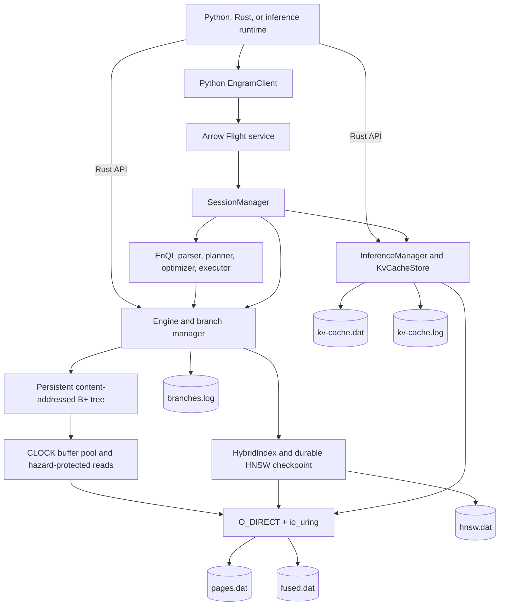

# EngramDB architecture and real-world use cases

This document describes the implementation in this repository, not only the
long-term design proposed in the phase documents. EngramDB 0.1 is a Linux-only,
single-node research prototype. It combines:

- branchable, bitemporal key/value storage;
- a fused vector, graph, and temporal index;
- a small query language (EnQL) and Apache Arrow Flight service; and
- branch-scoped LLM KV-cache persistence.

These pieces can be evaluated together today, but EngramDB is not yet a
production database or a drop-in replacement for PostgreSQL, Neo4j, a vector
database, or an inference cache. The sections below distinguish implemented
behavior from integration ideas and future efficiency opportunities.

## 1. The core idea

An EngramDB branch is a durable pointer to immutable state. Forking a branch
records another pointer to the same roots; it does not copy the database.
Writes append new blocks and publish new roots for only the changed branch.
The parent continues to reference the old state.

This model is useful when an application needs many isolated variants of the
same context: agent plans, simulations, review candidates, or inference
sessions. EngramDB also co-locates semantic vectors, graph edges, and temporal
points in 64 KiB blocks so one execution engine can apply all three predicates.

There are three related but distinct data surfaces:

| Surface | Data | Primary API | Durable branch behavior |
| --- | --- | --- | --- |
| Temporal tree | arbitrary byte keys and values with valid and assertion time | Rust `Engine` / `Transaction` | copy-on-write root; limited three-way merge |
| Hybrid index | node ID, INT8-quantized vector, graph edges, temporal points | Rust `FusedNode`; Python Flight ingestion for edge-free nodes | immutable fused blocks plus a branch HNSW checkpoint |
| KV cache | model/layout metadata and raw cache tensor bytes | Python client and vLLM/SGLang adapters, or Rust `KvCacheStore` | child inherits the parent's immutable manifest |

The temporal tree and hybrid roots are committed in the engine branch log.
KV-cache manifests use a separate durable journal. They share a branch UUID
but are not one atomic cross-file transaction.

## 2. Component architecture



### 2.1 Public service boundary

`engramdb_server` opens one `Engine`, one `KvCacheStore`, and one
`InferenceManager`, then serves them through `SessionManager` and Arrow Flight.
The Python SDK is a small Flight wrapper rather than a second implementation.

Implemented Flight operations are:

| Operation | Wire representation | Purpose |
| --- | --- | --- |
| Main branch | `MainBranch` action | return the root branch UUID |
| Fork | `ForkSession` action with parent UUID | create a durable child branch |
| Seal | `CommitSession` action with session UUID | reject more writes through this live server |
| Explain | `Explain` action with `UUID\nEnQL` | return the chosen physical plan |
| Query | `DoGet` ticket `UUID\nEnQL` | return Arrow query batches |
| Hybrid ingest | `DoPut` path `<session UUID>` | commit an Arrow table as fused nodes |
| KV upload | `DoPut` path `kv-cache/<session UUID>` | commit cache bytes and tensor spec |
| KV download | `DoGet` ticket `KV\n<session UUID>` | return cache bytes through host memory |
| Hardware | `HardwareCapabilities` action | report the detected transfer path |
| Native KV metadata | manifest/ticket actions | return integrity metadata or aligned extents |

Flight authentication, TLS, Flight SQL, cancellation, distributed serving, and
server-side backpressure are not implemented.

### 2.2 Storage and I/O layer

All data paths use Linux `O_DIRECT` with aligned user-space allocations and
`io_uring` submissions:

| File | Block geometry | Contents |
| --- | --- | --- |
| `pages.dat` | 4 KiB blocks, 4 KiB aligned | immutable B+ tree pages |
| `fused.dat` | 64 KiB blocks, 4 KiB aligned | packed vector/graph/temporal nodes |
| `hnsw.dat` | variable append-only records | branch-addressable HNSW checkpoints |
| `branches.log` | framed append-only records | branch create, commit, and merge events |
| `kv-cache.dat` | 4 MiB blocks, 4 KiB aligned | 4 KiB header plus cache payload |
| `kv-cache.log` | framed append-only records | branch-to-KV-manifest mappings and watermarks |
| `engine.lock` | lock file | prevents two `Engine` instances opening one directory |

The current `DirectIo` API is synchronous from its caller's perspective and
serializes submissions through one `io_uring`. It does not yet expose a
multi-request asynchronous transaction pipeline.

Tree reads use a user-space CLOCK cache. Readers load immutable map snapshots
and protect resident pages with hazard pointers; cache insertion and eviction
are serialized. Fused blocks are held by a branch's in-memory `HybridIndex`
rather than this tree-page buffer pool.

## 3. Durable data structures

### 3.1 Content-addressed B+ tree

A 4 KiB page contains a fixed header and a deterministic leaf or internal-node
payload. The payload's BLAKE3 digest is the node identity. CRC32 detects
accidental corruption; parent references contain both the expected hash and
physical offset.

On insertion:

1. EngramDB descends from the branch root to the target leaf.
2. It creates a new leaf containing the change.
3. If the leaf no longer fits, it creates two new leaves and promotes a
   separator.
4. It creates new internal pages on the changed path up to a new root.
5. Unchanged subtrees remain referenced by both old and new roots.

Identical encoded nodes are deduplicated by hash within the page store.
Existing pages are never modified in place.

Temporal records encode this ordered key:

```text
logical key | valid_from | valid_to | asserted_at
```

`valid_from <= t < valid_to` answers when a fact is true in the represented
world. `asserted_at` is the engine commit epoch and answers when EngramDB
learned or recorded that fact. `get_as_of` chooses the newest assertion no
later than the requested assertion time.

Current caveat: `get_as_of` scans decoded tree entries rather than doing a
targeted B+ tree range lookup. The durable structure is ordered, but this read
path is not yet optimized for production temporal lookup throughput.

### 3.2 Fused vector/graph/temporal blocks

Each 64 KiB fused block contains:

1. a 64-byte versioned header and whole-payload CRC32;
2. a fixed-size node directory;
3. tightly packed `(assertion_time, valid_time)` points;
4. per-node scalar-quantized INT8 vectors; and
5. fixed-size outbound edges containing target hash, weight, and edge type.

FP32 vectors are quantized on ingest with one scale per vector. Cosine dot
products use AVX2 on supported x86-64 CPUs, NEON on supported AArch64 CPUs,
and a scalar fallback. Squared-L2 has an AVX2 and scalar path. This
implementation does not use product quantization or AVX-512.

The global approximate index is a deterministic HNSW graph. A durable
checkpoint stores node-to-block references and HNSW neighbors. A branch stores
the checkpoint's content hash, offset, and length as its hybrid root.

Hybrid node IDs are insert-only within a branch checkpoint: inserting a
duplicate ID is rejected, and no update/delete API exists. Edge weights are
stored and exported but current traversal uses only target and optional edge
type; it does not rank or filter by weight.

Pure nearest-neighbor EnQL uses HNSW. A tri-modal query can use:

- **graph first**: bounded breadth-first traversal, then vector and temporal
  predicates; or
- **vector first**: currently an exact quantized scan, intersected with the
  graph-reachable set.

The optimizer uses node count, a fixed average degree, cosine threshold, hop
count, and optional edge type. It is a small heuristic cost model, not a
statistics service with histograms.

### 3.3 KV-cache storage

A KV-cache manifest records:

- a model fingerprint;
- dtype and runtime layout;
- layer, block, head, head-size, sequence, and tensor-parallel geometry;
- total bytes and a whole-cache BLAKE3 hash; and
- physical block offsets, lengths, and per-payload hashes.

The store validates that the byte length exactly matches the declared tensor
geometry. Cache data is split into 4 MiB blocks. Each block reserves a 4 KiB
header and stores a 4 KiB-aligned payload extent. Headers include format
version, chunk position, tensor-spec fingerprint, and header/payload CRC32.

The ordinary Flight restore path reads and validates all blocks, constructs one
host-memory byte buffer, and returns it through Arrow. A native restore ticket
instead returns file and destination offsets for an external CUDA plugin.
Optional `libcufile` bindings exist, but the application is responsible for
CUDA allocation, file/buffer registration, context lifetime, and stream
synchronization.

`HardwareCapabilities` deliberately reports `CpuDirect` unless the available
stack supports a stronger classification. Merely loading `libcufile` does not
prove direct NVMe-to-GPU transfer. No repository test has yet established real
vLLM/SGLang ABI compatibility or GDS P2P I/O.

## 4. Branch, transaction, and session workflows

### 4.1 Fork

`Engine::fork(parent)`:

1. acquires the engine state write lock;
2. allocates a child UUID and epoch;
3. copies the parent's tree root and hybrid checkpoint reference;
4. appends and syncs a branch-create record; and
5. adds the child to the in-memory branch map.

No tree or fused blocks are copied. If inference support is active,
`SessionManager::fork_session` also appends a KV event mapping the child to the
parent's existing immutable manifest.

### 4.2 Commit data to one branch

`Engine::begin` captures the expected tree and hybrid roots. On commit:

1. the engine rejects the transaction if either root changed since `begin`;
2. temporal writes create copy-on-write B+ tree paths;
3. fused writes append 64 KiB blocks, rebuild HNSW, serialize a checkpoint,
   and append it to `hnsw.dat`;
4. EngramDB syncs tree, fused, and HNSW data;
5. it appends and syncs one branch commit event containing the new roots and
   data-file watermarks; and
6. it publishes the roots in memory.

The important ordering is **data first, metadata second**. A crash can leave
unreferenced appended blocks, but cannot make an unsynced block a committed
root.

### 4.3 Seal versus merge

`CommitSession` is named like a database commit, but it only marks an active
session as sealed in the current `SessionManager`. It does **not** merge the
child into its parent.

`Engine::merge(target, source)` is a separate Rust API. It performs a
three-way merge for parent/child or sibling branches sharing one fork root.
Non-overlapping temporal ranges are applied to the target. Overlapping,
different values conflict. Hybrid roots must be identical, so divergent fused
indexes cannot currently be merged.

Session active/committed state is in memory, not recovered from disk. Branch
roots are durable, but the server does not yet expose branch listing or
session-resume lifecycle APIs. This is a material operational limitation.

### 4.4 Recovery

On open, the engine:

1. obtains the exclusive directory lock;
2. replays complete, CRC-valid metadata records;
3. truncates an incomplete final metadata record;
4. validates monotonically increasing aligned watermarks;
5. truncates data appended beyond the final committed watermarks;
6. reconstructs branches and validates every committed tree and hybrid root;
7. verifies hashes, CRCs, offsets, HNSW references, and tree invariants; and
8. rejects corruption in data that a committed root references.

The KV journal uses the same data-before-watermark pattern independently.

## 5. Query workflow

For an EnQL request:

1. Flight identifies the branch/session UUID from the ticket.
2. The parser accepts either nearest-vector or bounded traversal syntax.
3. A logical plan describes vector scan or traversal plus temporal filters.
4. The optimizer chooses `VectorOnly`, `VectorFirst`, or `GraphFirst`.
5. The executor runs against the immutable hybrid root for that branch.
6. Results become rows `(id, score, depth)`.
7. Rows are split into Arrow batches (1,024 by default) and encoded by Flight.
8. Python receives a `pyarrow.Table`, with optional Pandas or Polars adapters.

The executor currently collects rows before batching; it is not a fully
streaming operator pipeline. The server also copies result values into Arrow
builders, so "Arrow transport" should not be described as end-to-end zero-copy.

Implemented EnQL forms are:

```text
VECTOR NEAREST [0.1, 0.2, ...] LIMIT 10
```

and:

```text
MATCH (a)-[:EDGE*1..3]->(b)
FROM <64-character-node-hash>
VECTOR [0.1, 0.2, ...]
COSINE > 0.80
ASSERTION < 100
VALID <= 20
EDGE_TYPE = 7
AS OF SYSTEM TIME 99
RETURN id,score,depth
LIMIT 10
```

This is a deliberately narrow grammar, not general SQL or Cypher.

## 6. How to use EngramDB today

### 6.1 Requirements and startup

EngramDB requires Linux, a filesystem/device that permits `O_DIRECT`, and a
Rust toolchain compatible with `Cargo.toml`. Start the server with:

```bash
cargo run --release --bin engramdb_server -- \
  --data-dir /var/lib/engramdb \
  --address 127.0.0.1:50051
```

Install the local Python client:

```bash
python -m pip install -e ./python
```

The server has no authentication or TLS. Bind it to loopback or place it behind
an authenticated private service boundary during evaluation.

### 6.2 Python: branch, ingest, query, and seal

Flight ingestion currently accepts exactly these columns:

- `key`: non-null string;
- `vector`: fixed-size list of float32;
- `assertion_time`: non-null uint64; and
- `valid_time`: non-null int64.

All vectors in one durable hybrid index must have the same dimension.

```python
import pyarrow as pa
from engramdb import EngramClient

client = EngramClient("grpc://127.0.0.1:50051")
parent = client.main_branch()
session = client.fork_session(parent)

vectors = pa.FixedSizeListArray.from_arrays(
    pa.array([1.0, 0.0, 0.98, 0.02], type=pa.float32()),
    2,
)
table = pa.table(
    {
        "key": pa.array(["incident-17", "runbook-network"]),
        "vector": vectors,
        "assertion_time": pa.array([10, 10], type=pa.uint64()),
        "valid_time": pa.array([20, 20], type=pa.int64()),
    }
)

client.ingest(table, session)
print(client.explain("VECTOR NEAREST [1.0,0.0] LIMIT 5", session))
results = client.query("VECTOR NEAREST [1.0,0.0] LIMIT 5", session)
client.commit_session(session)  # seals; does not merge into parent
```

The Python Flight ingestion path creates nodes with no graph edges and one
temporal point. Use the Rust API to create graph-bearing `FusedNode` values.
The client also has no temporal-tree put/get API; use Rust for that surface.

### 6.3 Rust: bitemporal branch workflow

```rust
use engramdb::{Engine, TemporalRecord};

let engine = Engine::open("/var/lib/engramdb")?;
let main = engine.main_branch();
let scenario = engine.fork(main.id)?;

let mut tx = engine.begin(scenario.id)?;
tx.put(TemporalRecord::new(
    "policy:refund",
    "manual-review-required",
    1_735_689_600, // valid_from
    1_767_225_600, // valid_to
)?)?;
tx.commit()?;

let current = engine.get(
    scenario.id,
    b"policy:refund",
    1_750_000_000,
)?;

# Ok::<(), engramdb::Error>(())
```

Use `get_as_of` when the application must distinguish event/valid time from
the engine assertion epoch. Use `Engine::merge` explicitly if the child should
be incorporated into the parent.

### 6.4 Rust: graph-bearing hybrid workflow

```rust
use engramdb::{Engine, FusedNode, GraphEdge, Hash, TemporalPoint};

let engine = Engine::open("/var/lib/engramdb")?;
let branch = engine.fork(engine.main_branch().id)?;
let runbook_id = Hash(*blake3::hash(b"runbook-network").as_bytes());

let incident = FusedNode::new(
    "incident-17",
    vec![TemporalPoint { assertion_time: 10, valid_time: 20 }],
    vec![1.0, 0.0],
    vec![GraphEdge {
        target: runbook_id,
        weight: 1.0,
        edge_type: 7,
    }],
)?;
let runbook = FusedNode::new(
    "runbook-network",
    vec![TemporalPoint { assertion_time: 8, valid_time: 20 }],
    vec![0.98, 0.02],
    vec![],
)?;

let mut tx = engine.begin(branch.id)?;
tx.put_fused(incident)?;
tx.put_fused(runbook)?;
tx.commit()?;

# Ok::<(), engramdb::Error>(())
```

Node IDs are BLAKE3 hashes of the key passed to `FusedNode::new`. Edges must
target those hashes.

### 6.5 Python: persist and restore a KV cache

The runtime must export bytes in one of the declared canonical layouts and
supply exact tensor geometry. This tiny example follows the tested vLLM shape:

```python
import hashlib
import struct
from engramdb import EngramClient, VllmKvCacheAdapter

client = EngramClient()
session = client.fork_session(client.main_branch())
adapter = VllmKvCacheAdapter(client)

cache = b"".join(struct.pack("<f", value) for value in range(16))
spec = {
    "model_fingerprint": list(hashlib.blake2s(b"model-build-v1").digest()),
    "dtype": "Fp32",
    "layout": "VllmPagedV1",
    "num_layers": 1,
    "num_blocks": 1,
    "num_kv_heads": 1,
    "head_size": 4,
    "block_size": 2,
    "sequence_length": 2,
    "tensor_parallel_rank": 0,
    "tensor_parallel_world": 1,
}

adapter.store(session, spec, cache)
restored, restored_spec = adapter.restore_bytes(session)
assert restored.tobytes() == cache
assert restored_spec == spec
```

For a native CUDA plugin, call `native_restore_ticket`. Treat the returned
`transfer_path` as authoritative. A `CpuDirect` ticket is not proof of GDS and
the normal adapter still restores through host memory.

## 7. Real-world scenarios

### 7.1 Speculative AI-agent memory and planning

**Scenario:** An operations agent has a durable world model and evaluates five
remediation plans without allowing one plan's observations to contaminate the
others.

**Workflow:**

1. Keep the accepted world model on a parent branch.
2. Fork one child session per candidate plan.
3. Add candidate-specific observations or embeddings to each child.
4. Query each child independently and score its outcome.
5. Seal rejected candidates for audit or discard them operationally.
6. For temporal-tree-only changes, explicitly merge the winning child into the
   parent after conflict checks.

**What is commonly used today:** tenant/session columns in PostgreSQL, copied
schemas, application-level event logs, or one vector namespace per agent.

**Potential advantage:** fork cost is metadata-sized and independent of the
existing data set because roots are shared. The Phase 3 validation reached
5,000 durable sessions with approximately 167 bytes of durable branch metadata
and 594 bytes of process RSS growth per session on that test host.

**Current limits:** Flight has no merge action, divergent hybrid roots cannot
merge, session lifecycle is not recovered, and there is no branch deletion or
garbage collection. A production orchestrator cannot adopt this flow without
additional lifecycle services.

### 7.2 Semantic knowledge-graph retrieval

**Scenario:** Incident response asks, "Starting at this service, find runbooks
within three dependency hops that are semantically similar to a network
failure and were valid at the incident time."

**Workflow:**

1. Embed services, incidents, and runbooks.
2. Create graph edges such as `DEPENDS_ON`, `AFFECTS`, or `RESOLVED_BY`.
3. Attach assertion and valid-time points.
4. Ingest graph-bearing fused nodes with the Rust API.
5. Submit a bounded EnQL traversal with vector, edge-type, and time filters.
6. Let the optimizer choose graph-first or vector-first execution.
7. Consume compact Arrow rows and fetch full source documents from the
   application's content store if needed.

**What is commonly used today:** Qdrant/Pinecone/pgvector for similarity,
Neo4j for topology, PostgreSQL for metadata, and middleware that intersects
IDs across systems.

**Potential advantage:** one durable node representation and one execution
process can avoid cross-service round trips, duplicate IDs, and application
joins. The repository has measured microsecond in-process tri-modal kernels,
but not a same-hardware comparison against the multi-product stack. Over
Flight, the validation measured hundreds of microseconds, so in-process
numbers must not be presented as network query latency.

**Current limits:** Python cannot ingest edges, EnQL is narrow, vector-first
tri-modal execution uses an exact scan, and the fused layout has not shown the
claimed cache-miss advantage in Cachegrind.

### 7.3 Bitemporal policy, pricing, and audit replay

**Scenario:** A pricing system needs to answer both "What price was valid on
June 1?" and "What did we believe the June 1 price was before a correction
arrived on June 10?"

**Workflow:**

1. Write each value with its business-valid interval.
2. Let the commit epoch become its assertion time.
3. Use `get` for the latest known assertion at a valid time.
4. Use `get_as_of` to replay knowledge as of an earlier assertion epoch.
5. Fork before importing a correction batch.
6. Validate reports on the child, then merge non-conflicting temporal ranges.

**What is commonly used today:** PostgreSQL history tables and range types,
SQL Server temporal tables, or event sourcing plus projection tables.

**Potential advantage:** immutable pages and branch roots make test imports
and historical variants cheap to isolate, while content hashes make corruption
detectable.

**Current limits:** point reads scan entries, query access is Rust-only, merge
topology is limited, and the prototype lacks secondary indexes, deletion,
compaction, backup tooling, and SQL interoperability. Mature relational
temporal databases remain the safer default for production systems.

### 7.4 Reusable LLM prompt-prefix state

**Scenario:** Many requests share an expensive, stable prompt prefix such as a
large manual, policy corpus, or agent history. The inference service wants to
persist the computed attention KV state and reuse it later.

**Workflow:**

1. The inference runtime performs normal prefill for the prefix.
2. Its integration plugin exports canonical cache bytes and an exact
   `KvCacheSpec`.
3. Store the bytes on a branch through the adapter.
4. Forking a child inherits the parent's manifest without copying cache data.
5. On resume, validate model fingerprint, dtype, layout, tensor-parallel rank,
   and sequence geometry.
6. Restore through host memory, or have a native plugin execute the aligned
   extents in a restore ticket.
7. Run decode only after runtime-specific position state and cache ABI checks
   pass.

**What is commonly used today:** vLLM/SGLang in-memory prefix caching,
LMCache, Mooncake, Redis/object storage, or recomputing prefill.

**Potential advantage:** branch inheritance can associate the same immutable
cache with many speculative sessions, and the on-disk format is already
aligned for a future direct device reader.

**Current limits:** EngramDB currently writes full snapshots and has no
partial-prefix lookup, delta caches, eviction, compaction, multi-rank atomic
publish, or verified runtime ABI. GDS and time-to-first-token gains are
unverified. Without a validated native path, this is a durable CPU direct-I/O
cache, not evidence of superiority over LMCache or Mooncake.

### 7.5 Reproducible simulations and digital twins

**Scenario:** A scheduler or supply-chain model evaluates many future states
from one observed baseline while preserving valid-time facts and dependency
relationships.

**Workflow:**

1. Materialize the observed baseline as temporal values and fused graph nodes.
2. Fork one branch per policy or forecast.
3. Append scenario-specific temporal changes.
4. Query each branch for semantically and topologically relevant constraints.
5. Compare outputs while retaining exact root hashes for reproducibility.
6. Merge only compatible accepted temporal ranges, or retain a selected branch
   as the next baseline.

**What is commonly used today:** full database snapshots, copied schemas,
in-memory graph copies, or event-log replay for every scenario.

**Potential advantage:** structural sharing avoids copying unchanged baseline
pages for each scenario.

**Current limits:** the system has no scheduler, branch TTL, branch deletion,
storage reclamation, distributed execution, or bulk scenario-management API.

## 8. Replacement and consolidation map

| Existing approach | EngramDB role | Why it could be more efficient | What prevents a drop-in replacement today |
| --- | --- | --- | --- |
| copied PostgreSQL schemas/databases for sandboxes | branch roots | fork writes metadata rather than copying rows | no SQL, auth, replication, mature operations, or general relational model |
| event sourcing plus rebuilt projections | immutable temporal branches | historical roots are directly addressable; scenario forks share pages | slow current point lookup, limited merge and lifecycle APIs |
| vector DB + graph DB + temporal relational DB | fused hybrid index and one planner | fewer network boundaries and duplicate representations | limited ingestion/query grammar; no distributed serving; no measured head-to-head win |
| one vector collection/namespace per agent | branch-scoped hybrid roots | immutable checkpoints can be shared at fork | divergent hybrid merges, delete, GC, and namespace administration are missing |
| JSON/BSON ingestion into Python services | Arrow Flight batches | columnar native buffers reduce Python object serialization | server still buffers ingest and copies into internal blocks |
| recomputing stable LLM prompt prefixes | persisted KV snapshots | restore can avoid repeated prefill when cache compatibility is exact | real-runtime compatibility and TTFT benefit are not validated |
| Redis/object storage for raw KV blobs | typed, checksummed aligned KV blocks | tensor geometry validation, branch inheritance, corruption checks, native extent tickets | no cache policy, network scale-out, partial reuse, or production runtime plugin |
| LMCache/Mooncake | local branch-aware cache experiment | unifies cache identity with database branch state | those systems target mature/distributed inference use cases; EngramDB has no proven performance advantage |

The realistic near-term positioning is not "replace every database." It is:

1. evaluate EngramDB as an embedded or loopback service for workloads dominated
   by cheap isolated forks;
2. use the fused index only when the same request genuinely combines vector,
   graph, and temporal predicates;
3. use KV persistence first as a correctness experiment on CPU;
4. retain the current production systems as systems of record until EngramDB
   has production lifecycle, security, observability, and recovery operations;
5. run same-hardware shadow benchmarks before claiming efficiency gains.

## 9. Evidence and claim boundaries

Repository validation currently supports these statements:

- copy-on-write branch isolation and crash recovery have automated tests;
- SIFT1M Recall@10 was 0.981 over 200 official queries in the committed
  validation;
- 5,000 durable session forks completed in the Phase 3 validation;
- Arrow Flight and the Python/Pandas/Polars surfaces work;
- KV bytes and a small software-attention oracle round-trip bit-identically;
- the RTX 2000 Ada evaluation selected `CpuDirect`, not verified GDS.

It does **not** establish:

- production safety, multi-process service availability, or distributed scale;
- a performance win over PostgreSQL, Neo4j, Qdrant, Pinecone, LMCache, or
  Mooncake on the same hardware;
- end-to-end zero-copy Arrow execution;
- a fused-layout cache-miss win;
- real vLLM/SGLang restored-logit identity; or
- direct NVMe-to-GPU bandwidth or TTFT improvement.

See the phase validation reports and
[`metrics-eval/EVALUATION-REPORT.md`](../metrics-eval/EVALUATION-REPORT.md) for
the measured environments, raw limitations, and hardware verdict.

## 10. Productionization priorities

The shortest path from research prototype to a narrowly deployable service is:

1. durable branch/session enumeration, resume, delete, and TTL semantics;
2. compaction and garbage collection for unreachable tree, fused, HNSW, and KV
   blocks;
3. authenticated TLS, authorization, quotas, request limits, and backpressure;
4. streaming ingest/execution rather than whole-request buffering;
5. indexed temporal lookups and broader, versioned client APIs;
6. a defined merge policy for hybrid roots and coordinated KV/branch commits;
7. backup, restore, metrics, tracing, health checks, and corruption runbooks;
8. a real vLLM or SGLang plugin with model/version compatibility keys;
9. multi-rank cache publication and partial-prefix/delta cache support; and
10. same-hardware product benchmarks, followed by GDS validation only on a
    supported GPU/NVMe topology with P2P counters.

Until those exist, EngramDB should be deployed only as an isolated research
component with reproducible source data, not as the sole copy of critical
production state.
