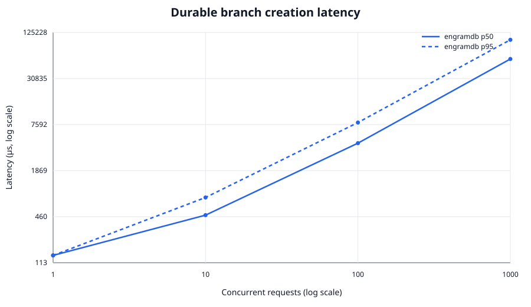
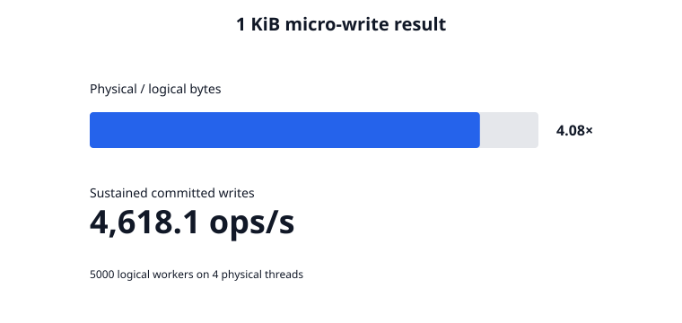

# Phase 1 validation report

## Result

Phase 1 passes its implementation validation on commit
`e81dfe719006dd9e7fdbde696cebcd60763c7ae3`. The foundation is ready for a
Phase 2 prototype after the page-size boundary is generalized, but it is not
yet a production storage engine.

The complete run is reproducible with:

```bash
./scripts/validate_phase1.sh
```

Raw observations, plots, and the full machine description are committed under
[`metrics/phase1/`](../metrics/phase1/).

## Validation matrix

| Area | Executed validation | Result |
| --- | --- | --- |
| Static gates | `cargo fmt --check`; Clippy for all targets with warnings denied | Pass |
| Rust tests | 23 normal tests across storage, branching, recovery, properties, and hazards | Pass |
| Hazard pointers | Loom model of publish/validate/reclaim interleavings; 4 readers × 10,000 actual loads during 10,000 replacements | Pass |
| Branch isolation | 64 proptest cases × 32 random fork/write operations (2,048 total) | Pass |
| Long-haul branches | Release-mode 1,000 durable forks and 1,000 three-way merges | Pass |
| Crash boundaries | Page-written, data-synced, and partial-metadata boundaries plus 96 deterministic randomized cycles | Pass |
| Corruption handling | Torn trailing data, non-final torn orphan pages, committed data/metadata bit corruption, metadata-length corruption, full committed DAG traversal | Pass |
| B+ tree | 250-key split/recovery test, point reads after reopen, hash deduplication, concurrent readers during 100 split-producing commits | Pass |
| Temporal behavior | assertion-time reads, non-overlapping merge, overlapping conflict, stale transaction rejection | Pass |
| Ownership/error state | exclusive directory lock; partial metadata write poisons the live engine until reopen | Pass |

Recovery publishes only a metadata root whose pages were synced first. Each
record carries the committed page-file watermark, so all later orphan pages are
discarded before the index is rebuilt. Header and payload checksums ensure a
corrupted length or complete record is reported rather than silently rolled
back.

## Measured metrics

Environment: 4-vCPU KVM Intel Xeon, Linux 6.12.94+, Rust 1.98.1, overlay
filesystem. These are single-run engineering measurements, not statistically
controlled NVMe results.

### Durable branch creation

The source tree contained 1,000 records. Each observation includes metadata-log
append and `sync_data`; branches allocate no tree pages.

| Concurrent requests | Samples | p50 | p95 | Batch wall time |
| ---: | ---: | ---: | ---: | ---: |
| 1 | 1 | 179.9 µs | 179.9 µs | 306.0 µs |
| 10 | 10 | 524.7 µs | 911.4 µs | 1.27 ms |
| 100 | 100 | 4.64 ms | 8.43 ms | 11.46 ms |
| 1,000 | 1,000 | 53.24 ms | 96.65 ms | 126.68 ms |

Branch work is O(1) in tree size, but latency is not O(1) in concurrent request
count: Phase 1 serializes the durable metadata append behind the branch-state
write lock. The 1,000-request batch completed at approximately 7,894 forks/s.



### 1 KiB micro-writes

The requested 5,000 logical workers were scheduled on all 4 available physical
threads. Each worker committed one 1 KiB record to its own pre-created branch.
Branch setup was excluded from the timed interval.

| Writes | Elapsed | Throughput | Logical bytes | Physical growth | Amplification |
| ---: | ---: | ---: | ---: | ---: | ---: |
| 5,000 | 1.0571 s | 4,730.0 ops/s | 5,120,000 | 20,945,000 | 4.091× |

The 4 KiB page granularity accounts for 20,484,096 direct-I/O bytes; metadata
accounts for the remaining growth. No compaction or group commit is implemented
in Phase 1.



## Product comparison

Only EngramDB was measured in this environment. PostgreSQL, MongoDB, Docker,
`psql`, and `mongosh` were unavailable, so reporting numeric competitor results
would be fabricated. [`scripts/compare_products.py`](../scripts/compare_products.py)
implements the specified `asyncpg` schema/table-copy and PyMongo `$out`
workloads with the same dataset size and concurrency levels.

| Property | EngramDB `fork` | PostgreSQL schema + CTAS | MongoDB aggregation `$out` |
| --- | --- | --- | --- |
| Work with dataset size | One root reference; O(1) | Copies table rows; O(data) | Copies collection documents; O(data) |
| Isolation unit | Native branch root and epoch | Schema/table copy | Output collection |
| Measured here | Yes | No—service unavailable | No—service unavailable |
| Reproduction input | `phase1-bench branch` | `POSTGRES_DSN` | `MONGODB_URI` |

Comparison runs must use the same host/storage class and preserve the raw CSV.
After concatenating product CSVs, `plot_metrics.py branch` renders a combined
p50/p95 plot without altering observations.

## Limitations and Phase 2 readiness

- Direct I/O is genuinely submitted with `io_uring`, but the synchronous API
  serializes one submission/completion at a time. Queue-depth batching and
  group commit remain necessary for production concurrency.
- The cache uses CLOCK, not full CLOCK-Pro/LIRS. Reads use an immutable
  `ArcSwap` index and hazard-protected `Arc<Page>` values.
- The immutable index is a B+ tree, not a Fractal Tree or B-Link tree. CoW roots
  make old-reader traversal safe, but B-Link sibling traversal is not present.
- Data pages are fixed at 4 KiB. Phase 2's 64 KiB fused block must be introduced
  through a page-size/layout abstraction before index work relies on this API.
- Three-way merge supports updates/inserts on direct parent/child or sibling
  branches with a shared fork root. Deletes, arbitrary ancestry, and custom
  conflict resolvers are not implemented.
- Aborted commits leave unreachable content-addressed pages. There is no
  garbage collection, free-space reuse, checkpoint, or compaction.
- Fault injection covers durable transaction boundaries and torn tails, but it
  does not kill the process during an in-flight kernel write. A subprocess
  SIGKILL/device fault campaign on real NVMe is still required.
- An uncertain `io_uring_enter` result deliberately retains its 4 KiB
  request-owned buffer until process exit to rule out kernel use-after-free;
  repeated fatal submission errors therefore require process restart.
- Metrics came from an overlay filesystem on a 4-vCPU VM. The 5,000 workers are
  logical jobs on four threads, not 5,000 simultaneously running OS threads.
- No PostgreSQL/MongoDB service was available for numeric comparison.

Phase 2 prototype readiness is **conditional yes**: immutable hashed nodes,
stable `(hash, offset)` child references, branch isolation, temporal reads, and
recovery are validated. Generalizing the block size and keeping Phase 2 layout
types independent of the current temporal-record encoding are the two required
boundary changes. Production readiness is **no** until queueing, reclamation,
broader merge semantics, and real-device crash testing are addressed.
