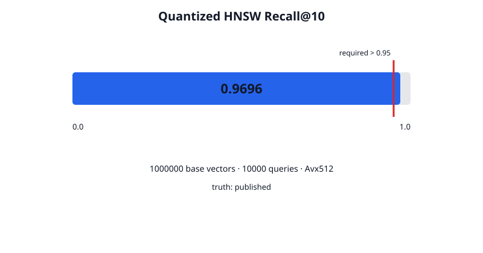
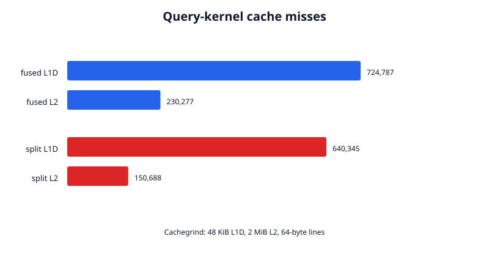
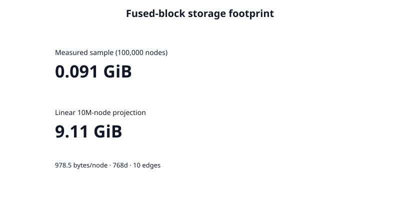

# Phase 2 validation report

## Result

Phase 2 implements a durable 64 KiB fused semantic/graph/temporal block format,
deterministic asymmetric INT8 quantization, AVX-512/NEON/scalar distance
kernels, a deterministic in-memory HNSW graph, historical temporal versions,
and multi-hop filtered traversal. Phase 1 remains on its unchanged 4 KiB file
format.

The validation is reproducible with:

```bash
./scripts/validate_phase2.sh
```

Raw observations, profiler output, checksums, machine details, and plots are in
[`metrics/phase2/`](../metrics/phase2/).
`sift-validation-commit.txt` and `cache-validation-commit.txt` pin the exact
revisions used for the long SIFT and Cachegrind runs; `system.txt` pins the
current-code regression/query run.

## Validation matrix

| Area | Executed validation | Result |
| --- | --- | --- |
| Static gates | Formatting; Clippy for all targets with warnings denied | Pass |
| Phase 1 regressions | 23 Phase 1 tests plus release-mode 1,000 forks/1,000 merges | Pass |
| Phase 2 tests | 13 layout, SIMD, recall, durability, temporal-version, traversal, and recovery tests | Pass |
| 64 KiB readiness | Size-aligned generic direct I/O round trip; Phase 1 remains 4 KiB | Pass |
| Fused integrity | Header+payload CRC, checked section/CSR bounds, finite scales/weights, corruption rejection | Pass |
| Generation recovery | Block-write, block-sync, and partial-manifest faults; failed generations cannot leak into later commits | Pass |
| Recall | Checksum-pinned full SIFT1M: 1M base vectors, 10K queries, published neighbors | Pass: Recall@10 0.96955 |
| Multi-modal correctness | Synthetic temporal graph traversal compared with a brute-force oracle | Pass |
| Query workload | 10,000 randomized three-hop semantic+graph+time queries | Pass |
| Cache profiling | Paired fused/split INT8 query kernels under the same explicit Cachegrind model | Fail: fused misses were higher |
| Hardware cache counters | `perf stat` on the cloud VM | Unavailable: kernel tooling/policy |
| External products | PostgreSQL/pgvector and Neo4j/Qdrant | Not run: services not configured |

## Recall

The official SIFT1M files were verified against committed SHA-256 fingerprints.
The run used all 1,000,000 128-dimensional base vectors, all 10,000 queries, and
the published top-100 neighbor file. HNSW used `M=16`,
`efConstruction=128`, and `efSearch=1024`.

| Build | Query total | Recall@10 | SIMD | Fused block bytes |
| ---: | ---: | ---: | --- | ---: |
| 408.19 s | 466.81 s | 0.96964 | AVX-512 | 172,490,752 |

The first symmetric-INT8 run failed at 0.9223. The passing result comes from the
committed asymmetric per-vector scale/zero-point encoding; the threshold was
not weakened.



## Tri-modal query latency

The measured workload contains 10,000 nodes, 128-dimensional vectors, ten
deterministically scattered edges per node, and future assertion-time revisions
for 10% of nodes. Every query traverses three hops and applies cosine
similarity, valid-time, and assertion-time filters.

| Queries | p50 | p90 | p99 | Mean visited records | Mean 64 KiB block reads |
| ---: | ---: | ---: | ---: | ---: | ---: |
| 10,000 | 4.273 ms | 4.997 ms | 8.137 ms | 1,089.1 | 56.0 |


## Cache behavior

Cachegrind ran identical 10,000-node, 100-query graph workloads with a 48 KiB
L1D and explicit 2 MiB, 16-way, 64-byte-line L2 model. The table isolates the
`#[inline(never)]` query kernels, excluding setup.

| Layout | Data references | L1D misses | L2 misses |
| --- | ---: | ---: | ---: |
| Fused | 39,312,763 | 724,787 | 230,277 |
| Split pointer layout | 33,022,598 | 640,345 | 150,688 |

Both kernels use the same INT8 vectors, scattered graph, traversal order, and
SIMD dot product. The inclusive totals cover the query function and its SIMD
callee; fused also includes header decoding. The fused path produced 13.2% more
L1D misses and 52.8% more modeled L2 misses than the split baseline, so the
Phase 2 cache-locality target did not pass. These are simulated cache results,
not hardware counters; `perf` was unavailable for the running kernel.



## Storage footprint

The storage run wrote a 100,000-node block file with 768-dimensional INT8
vectors and ten 16-byte edges each.

| Sample | Blocks | Block-file length | Bytes/node | Linear 10M projection |
| ---: | ---: | ---: | ---: | ---: |
| 100,000 | 1,493 | 97,845,248 | 978.45 | 9,784,524,800 (9.11 GiB) |

The ten-million-node value is a linear projection from measured block packing,
not a ten-million-node write. It excludes the in-memory HNSW links because
Phase 2 rebuilds that graph from fused blocks on open.



## Product comparison

No PostgreSQL/pgvector, Neo4j, or Qdrant service was available. Numeric
competitor values would therefore be fabricated and are intentionally absent.
[`scripts/compare_phase2_products.py`](../scripts/compare_phase2_products.py)
implements the same 10,000-query recursive-graph, semantic, and temporal
workload when DSNs are supplied.

| Stack | Query path | Measured here |
| --- | --- | --- |
| EngramDB | One process; fused block traversal and temporal/SIMD filtering | Yes |
| PostgreSQL + pgvector | Recursive CTE joined to temporal rows and vector distance | No |
| Neo4j + Qdrant | Qdrant semantic/temporal candidates intersected with three-hop Neo4j reachability | No |

No 10–100× cross-product speedup claim is made.

## Limitations and Phase 3 readiness

- Fused blocks and the Phase 1 branch engine use separate durable manifests.
  A hybrid generation is not yet atomically committed with a branch root.
- HNSW links are deterministic but in-memory only. Reopening SIFT1M requires a
  full rebuild; the measured build took 408.19 seconds.
- Inserts and historical versions are supported; deletes, tombstones, index
  compaction, and branch-aware hybrid merges are not.
- The implementation uses INT8 scalar quantization, not PQ or FP8.
- AVX-512 was executed and scalar equivalence was tested. The NEON path compiled
  conditionally but was not run on ARM hardware.
- One 64 KiB read supplies all modalities for every record in that block, but a
  three-hop query still averaged 56 block reads due to scattered graph edges.
- Cache results are simulated. Hardware L2/L3 counters and physical NVMe read
  counts remain unmeasured on this VM.
- The 10M storage number is projected; external product storage and latency
  measurements remain pending equivalent provisioned services.

Phase 3 readiness is **no** against the requested architecture because the fair
Cachegrind comparison failed the cache-locality objective. The fused reader,
ANN candidate API, historical temporal selection, graph traversal, and result
statistics are otherwise validated and could support an explicitly
experimental read-only executor. Before Phase 3 begins, EngramDB should
redesign or cache decoded fused metadata until the fair cache test passes,
define one atomic publication protocol spanning branch roots and fused-index
generations, and persist/checkpoint HNSW. Production readiness is also **no**
until deletion/compaction, ARM testing, hardware cache profiling, and external
comparisons are completed.
