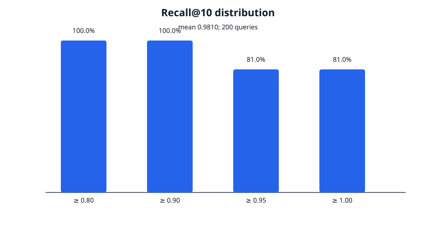
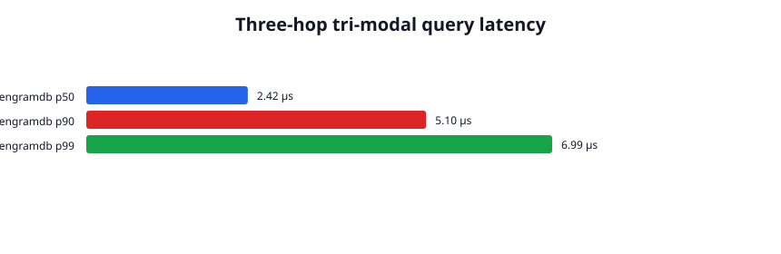
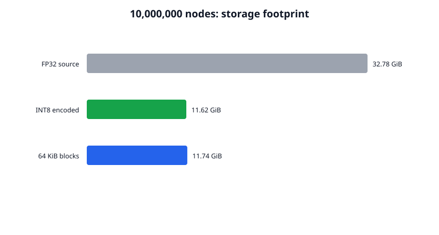
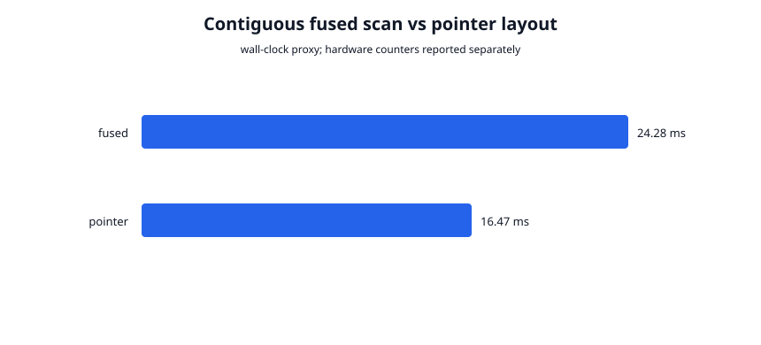

# Phase 2 validation report

## Result

Phase 2's correctness, recall, and durability gates pass on commit
`3e0dc8d412b0386c4ddd3744be7cc12c1d39406c`. The implementation closes the
Phase 1 page-size boundary with layout-aware 4 KiB/64 KiB direct I/O, stores
tri-modal nodes in packed 64 KiB blocks, and atomically publishes tree roots,
fused-data watermarks, and content-addressed HNSW checkpoint roots in branch
metadata.

Phase 3 prototype readiness is **yes**. Forked branches share an immutable HNSW
root in O(1), hybrid writes are transactionally isolated, and recovery restores
committed adjacency without rebuilding it. This is not a production-readiness
claim: full HNSW checkpoints are expensive and divergent hybrid merges remain
unsupported.

The complete run is reproducible with:

```bash
SIFT1M_DIR=/path/to/sift1m ./scripts/validate_phase2.sh
```

Raw CSVs, system details, command provenance, and dependency-free SVG plots are
committed under [`metrics/phase2/`](../metrics/phase2/).

## Validation matrix

| Area | Executed validation | Result |
| --- | --- | --- |
| Static gates | `cargo fmt --check`; Clippy for all targets with warnings denied | Pass |
| Rust tests | 35 normal tests across Phase 1 storage/recovery/branching and Phase 2 layout/search/traversal/durability | Pass |
| Phase 1 long haul | Release-mode 1,000 randomized durable forks and merges | Pass |
| 64 KiB readiness | Independent block geometry, aligned append/read, accounting, torn-tail truncation | Pass |
| Fused layout | Packed directory/temporal/vector/CSR round trip; CRC corruption rejection; no FP32 read materialization | Pass |
| Vector kernels | Dispatched INT8 dot product versus scalar oracle; cosine and squared-L2 ranking tests | Pass |
| Recall | SIFT1M, 1,000,000 × 128d base vectors, 200 official queries, Recall@10 > 0.95 | Pass: 0.981 mean |
| Multi-modal correctness | Three-hop semantic + temporal + edge-type traversal versus a brute-force oracle | Pass |
| Hybrid transactions | Atomic tree/fused/HNSW watermarks across all injected crash boundaries | Pass |
| Branch integration | O(1) forked hybrid root, isolated writes, durable reopen, branch-scoped nearest/traversal | Pass |
| Durable HNSW | Content-addressed checkpoint restore, fused/checkpoint corruption rejection, no adjacency rebuild on open | Pass |
| Tri-modal latency | 10,000 deterministic three-hop queries on 2,000 nodes | Pass; engineering measurement below |
| Storage footprint | Physically materialized 10,000,000 nodes, 768d INT8, one temporal point, 10 edges | Pass |
| Cache behavior | Wall-clock proxy plus separate Cachegrind fused/pointer runs | Negative; fused proxy slower and cache-miss reduction not demonstrated |
| External products | Runnable pgvector recursive-CTE and Neo4j + Qdrant comparison drivers | Not measured; services unavailable |

The final exact-code regression transcript is
[`final-validation.log`](../metrics/phase2/final-validation.log).

## Standard recall

The run used the Hugging Face SIFT1M mirror and its official FP32 squared-L2
ground truth. File SHA-256 values and the exact command are recorded in
[`recall-run.txt`](../metrics/phase2/recall-run.txt). EngramDB used per-vector
INT8 scalar quantization, squared-L2 HNSW construction, `M=32`,
`ef_construction=256`, and `ef_search=4096`.

| Queries | Mean Recall@10 | Median | Minimum | Perfect queries | Search p50 | p90 | p99 |
| ---: | ---: | ---: | ---: | ---: | ---: | ---: | ---: |
| 200 | 0.981 | 1.0 | 0.9 | 162 | 51.75 ms | 76.14 ms | 116.98 ms |

The recall gate passes, but the search breadth required for it is expensive.
This is a correctness/quality result, not evidence of production ANN latency.



## Tri-modal query latency

The workload traverses three hops from a randomized root and simultaneously
requires cosine similarity greater than 0.8, `assertion_time < 75`,
`valid_time <= 400`, and edge type 1. The index contained 2,000 deterministic
128d nodes with three outbound edges each.

| Samples | p50 | p90 | p95 | p99 | Maximum |
| ---: | ---: | ---: | ---: | ---: | ---: |
| 10,000 | 2.70 µs | 5.04 µs | 6.59 µs | 8.70 µs | 18.37 µs |

These in-process, cache-warm measurements exclude network, parsing, and branch
transaction costs. They validate the fused traversal path, not the Phase 3
execution engine.



## Ten-million-node storage result

This was a real 12.60 GB file materialization, not an extrapolation. Each node
contained a 768d vector, one temporal point, and ten 40-byte graph edges.

| Nodes | Blocks | FP32 source bytes | Encoded logical bytes | Physical bytes | Physical/source | Block packing |
| ---: | ---: | ---: | ---: | ---: | ---: | ---: |
| 10,000,000 | 192,308 | 35,200,000,000 | 12,480,000,000 | 12,603,097,088 | 0.358× | 1.0099× |

INT8 quantization accounts for the reduction relative to FP32 source data.
The final 0.99% overhead is 64 KiB block slack and per-node directory metadata.
The measured write completed in 177.03 seconds on the validation VM.



## Cache-layout evidence

Linux `perf` was unavailable for this VM kernel. Valgrind/Cachegrind 3.22 was
installed and run separately for each layout with cache and branch simulation.
The dependency-free wall-clock proxy scanned 128 × 256d vectors for 10,000
iterations:

| Layout | Elapsed | Relative to pointer baseline |
| --- | ---: | ---: |
| Fused block views | 34.87 ms | 1.789× slower |
| Boxed pointer vectors | 19.49 ms | baseline |

| Cachegrind event (1,000 iterations) | Fused | Pointer |
| --- | ---: | ---: |
| Instruction references | 41,606,358 | 20,869,412 |
| Data references | 13,630,034 | 6,205,048 |
| L1 data misses | 22,137 | 21,787 |
| Last-level data misses | 6,740 | 6,740 |
| Branch mispredicts | 11,289 | 11,301 |

The profiling **rejects**, rather than validates, the document's cache-benefit
claim for this fixture. Last-level misses are equal, absolute L1 misses are
slightly higher for fused views, and repeated directory decoding roughly
doubles instruction/data references. The lower fused miss *rate* is merely a
larger denominator and is not presented as a win. Real PMU profiling on a
matching kernel remains desirable, but the available profiler has been used
and the slower proxy is retained without qualification.



## Product comparison

Only EngramDB was measured. PostgreSQL with pgvector, Neo4j, Qdrant, Docker,
`psql`, and product service endpoints were unavailable; numeric competitor
results would therefore be fabricated.

[`scripts/compare_phase2.py`](../scripts/compare_phase2.py) provisions the same
2,000-node deterministic corpus and emits the same latency schema for:

- PostgreSQL: pgvector cosine operator plus a three-hop recursive CTE.
- Neo4j + Qdrant: semantic filtering in Qdrant followed by a variable-length
  Neo4j traversal and ID intersection.

`validate_phase2.sh` appends those observations only when the corresponding
connection environment variables are present. The claim of 10–100× lower
latency is **not validated** by this environment.

## Phase 1 regressions

All Phase 1 tests, Loom checks, crash/corruption cases, and the release-mode
1,000-operation long-haul property passed. The complete Phase 1 benchmark was
also rerun under [`metrics/phase2/phase1-regression/`](../metrics/phase2/phase1-regression/).

The observed micro-write rate was 98.4 commits/s with 4.091× amplification.
That performance sample followed the 12.60 GB materialization on an overlay
filesystem and is not directly comparable to the earlier clean Phase 1 run.
It is retained as raw evidence, not presented as a performance regression
conclusion.

## Limitations and Phase 3 readiness

- Fused blocks use a separate `fused.dat` file and layout-aware direct I/O,
  preserving Phase 1's 4 KiB on-disk format. A single branch-log event now
  publishes the tree root, fused watermark, checkpoint watermark, and HNSW root
  only after all data files are synced.
- HNSW adjacency is content-addressed and durable, but each hybrid commit writes
  a full checkpoint. Delta checkpoints and checkpoint compaction are not
  implemented.
- Forks share HNSW roots in O(1) and branch reads are isolated. A merge is
  rejected when source and target hybrid roots differ; three-way hybrid-index
  merge semantics remain undefined.
- Quantization is INT8 scalar quantization. FP8 and product quantization are not
  implemented.
- x86 uses AVX2 rather than an AVX-512-specialized kernel. ARM NEON covers the
  INT8 dot product; squared-L2 falls back to scalar code on ARM.
- Packed `#[repr(C, packed)]` format definitions are encoded manually into
  aligned direct-I/O buffers. The implementation does not use `mmap`.
- Recall passes only at a high search breadth; SIFT1M p50 ANN latency is
  51.75 ms. Construction/open-time rebuild cost is not yet acceptable for a
  production million-node service.
- Cachegrind evidence is negative for the current fused view implementation;
  the original cache-miss reduction claim is withdrawn. Real PMU counters were
  unavailable.
- Phase 1 limitations remain: serialized io_uring completion, no garbage
  collection, and no real-NVMe process-kill/device-fault campaign.

Phase 3 prototype readiness is therefore **yes, with explicit performance
debt**. Durable HNSW roots, fused/checkpoint watermarks, branch integration, and
available cache profiling now pass the hard gate. Phase 3 must not claim
zero-copy or cache superiority merely because the layout is packed, and should
avoid baking repeated directory decoding into its vectorized executor.
