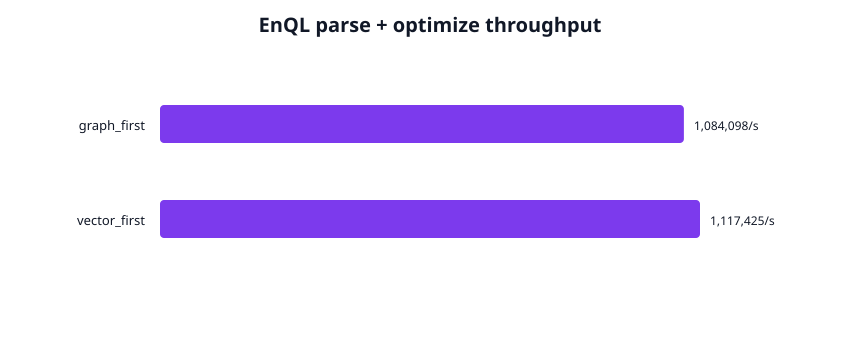
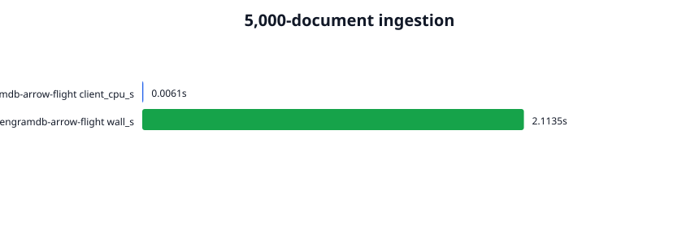
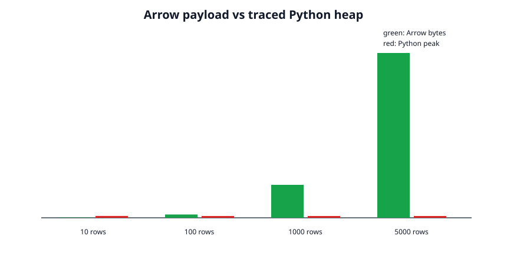
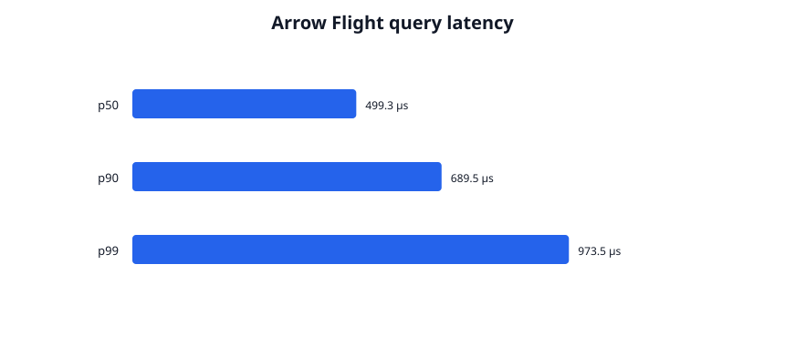
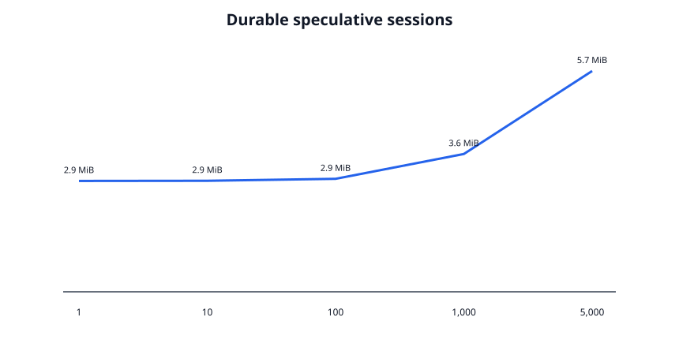

# Phase 3 validation report

## Result

Phase 3's parser, optimizer, Arrow, Flight, Python client, and durable-session
validation passes on commit `df5e598f2382db4316d8901b45a664302a505ba7`.
The complete Phase 1 and Phase 2 validation plans also pass on this dependency
set, including SIFT1M Recall@10 and the physical ten-million-node write.

Phase 4 readiness is **no / hold**. This environment has no NVIDIA GPU,
`libcufile`, `gdsio`, GDS-capable NVMe path, vLLM, or SGLang. Phase 3 also has
no KV-cache block schema or `GetKVCache` API. No Phase 4 code is included.

Run the Phase 3 plan with:

```bash
./scripts/validate_phase3.sh
```

Raw observations, profiles, plots, and the machine description are committed
under [`metrics/phase3/`](../metrics/phase3/).

## Implementation and validation matrix

| Area | Executed validation | Result |
| --- | --- | --- |
| Static gates | Rust formatting; strict Clippy for all targets; Python byte-code compilation | Pass |
| Rust tests | 41 normal Phase 1–3 tests | Pass |
| EnQL parser | Nearest and bounded Cypher-style traversal with vector/temporal/edge predicates | Pass |
| Optimizer | Selective vector-first and strict-topology graph-first golden EXPLAIN tests | Pass |
| Execution | Graph-first/vector-first result equivalence against the same branch snapshot | Pass |
| Vectorized output | Query rows emitted in 1,024-row Arrow batches | Pass |
| Arrow mapping | Fixed-size vectors, temporal `List<Struct>`, edge `List<Struct>`, query batches | Pass |
| Flight | Real TCP server; actions, DoPut ingestion, DoGet query stream | Pass |
| Sessions | Durable fork, ingestion, query, seal, reopen semantics inherited from Phase 2 branch roots | Pass |
| Python SDK | PyArrow Table, Pandas adapter, Polars LazyFrame adapter | Pass |
| Python allocation | `tracemalloc` while result payload grows from 400 B to 200 KB | Pass client-side; ~2.2 KB peak |
| Ingestion | 5,000 × 128d documents through PyArrow Flight with `cProfile` | Pass |
| Session scale | 1/10/100/1,000/5,000 durable sessions | Pass through 5,000; no exhaustion reached |
| Regressions | Full Phase 1–2 suite, SIFT1M recall, 10M-node write, Cachegrind | Pass with prior cache limitation unchanged |
| External products | Runnable PostgreSQL/Mongo profiling driver | Not measured; services unavailable |

## EnQL planning

The implemented EnQL subset supports:

- `VECTOR NEAREST [..] LIMIT n`
- bounded `MATCH ... [:EDGE*1..N] ...` traversal
- `FROM <node-hash>`, cosine threshold, assertion/valid-time filters
- optional edge type and `AS OF SYSTEM TIME`
- projection and limit

The optimizer applies the documented high-selectivity rule: cosine thresholds
above 0.98 choose vector-first; an edge-type predicate or short traversal
chooses graph-first. A small catalog cost model resolves the remaining cases.

| Plan | Parse + optimize iterations | Throughput |
| --- | ---: | ---: |
| Graph first | 100,000 | 1,084,098 plans/s |
| Vector first | 100,000 | 1,117,425 plans/s |



## Arrow Flight ingestion

The Python agent created one 5,000-row PyArrow Table with 128d
`FixedSizeList<float32>` vectors and sent it through Flight `DoPut`. The server
converted it into one durable branch transaction.

| Documents | Arrow input bytes | Client CPU | Durable wall time |
| ---: | ---: | ---: | ---: |
| 5,000 | 2,720,000 | 36.75 ms | 1.338 s |

`cProfile` attributes 3 ms of interpreted Python time to the SDK call; the
larger `process_time` includes native client work. The wall interval includes
network transfer, INT8 quantization, fused direct I/O, HNSW construction, full
checkpoint serialization, fsync, and metadata commit.

PostgreSQL and MongoDB endpoints were unavailable. No comparison values are
invented. [`scripts/compare_phase3.py`](../scripts/compare_phase3.py) provides
the matching 5,000-document `psycopg2.execute_batch` and `pymongo.insert_many`
workloads and emits the same CSV schema.



## Python allocation scaling

`tracemalloc` measured Python-managed allocations during `DoGet` and
`read_all()`. Arrow payload bytes grew 500× while traced Python peak remained
approximately constant:

| Rows | Arrow bytes | Python peak bytes |
| ---: | ---: | ---: |
| 10 | 400 | 2,244 |
| 100 | 4,000 | 2,175 |
| 1,000 | 40,000 | 2,178 |
| 5,000 | 200,000 | 2,178 |

This validates the document's **Python-side** allocation criterion. It does not
prove server-side zero-copy: the current server constructs Arrow buffers from
query rows, and fused projection export copies quantized vectors and edges into
Arrow builders.



## Flight query latency

One thousand network `DoGet` queries returned ten nearest nodes:

| Samples | Mean | p50 | p90 | p99 | Maximum |
| ---: | ---: | ---: | ---: | ---: | ---: |
| 1,000 | 361.4 µs | 335.8 µs | 406.1 µs | 756.3 µs | 895.0 µs |

The final Phase 2 in-process tri-modal p50 was 1.67 µs. These workloads are not
identical, but the roughly 200× boundary cost demonstrates that gRPC/Arrow and
client scheduling dominate microsecond kernels. Phase 3 must not market the
Phase 2 in-process number as over-the-wire latency.



## Durable session scaling

All sessions are real durable branch-log records, not in-memory mock IDs.
Each fork shares tree and HNSW roots and allocates no fused/tree pages.

| Sessions | Batch time | Process RSS | Data directory |
| ---: | ---: | ---: | ---: |
| 1 | 1.24 ms | 2.83 MiB | 4,414 B |
| 10 | 3.99 ms | 2.83 MiB | 5,917 B |
| 100 | 63.91 ms | 2.88 MiB | 20,947 B |
| 1,000 | 1.135 s | 3.52 MiB | 171,247 B |
| 5,000 | 3.460 s | 5.66 MiB | 839,247 B |

From one to 5,000 sessions, RSS increased by approximately 594 bytes/session
and durable storage by approximately 167 bytes/session. The run establishes a
5,000-session lower bound, not the exhaustion maximum. AutoGen, Letta, Mem0,
Docker statistics, and a PostgreSQL-backed competitor were unavailable.



## Regression evidence

On the Phase 3 branch:

- SIFT1M mean Recall@10 remains 0.981 over 200 official queries.
- The physical 10,000,000-node, 768d, ten-edge materialization completed.
- All Phase 1 crash/corruption/Loom tests and the 1,000-operation release
  branch property passed.
- All Phase 2 durable HNSW, fused-watermark, corruption, and isolation tests
  passed.
- Cachegrind still shows no fused cache advantage; the slower proxy and equal
  last-level misses remain documented in the Phase 2 report.

## Limitations and Phase 4 readiness

- EnQL is a deliberately bounded subset, not a full Cypher or SQL grammar.
- The cost model uses node count, average degree, threshold, and topology
  strictness; it does not maintain histograms or learned selectivity.
- Vector-first execution currently uses an exact quantized scan before graph
  intersection to preserve result equivalence. It is not yet an HNSW-driven
  selective join.
- The executor collects query rows before splitting output into 1,024-row
  batches. Operators themselves are not a streaming pipeline.
- Python-side allocation scaling passes, but server-side fused-to-Arrow export
  copies into Arrow builders. The implementation must not claim end-to-end
  zero-copy.
- `CommitSession` seals a durable branch; it does not merge the session into its
  parent. Divergent hybrid-index merges remain unsupported.
- `DoPut` accumulates decoded batches before one transaction, so very large
  ingests are memory-bound.
- Authentication, TLS, cancellation, Flight SQL, backpressure, and distributed
  serving are not implemented.
- PostgreSQL/MongoDB ingestion and Letta/Mem0 session comparisons were not
  measured because services were unavailable.

Phase 4 readiness is **no**. Required gates before Phase 4 include a versioned
KV-cache tensor block schema, branch-scoped `GetKVCache`, NVIDIA CUDA/GDS and
`libcufile` availability, a GDS-capable NVMe/GPU topology, and deterministic
vLLM/SGLang cache-restore integrity tests. No Phase 4 implementation was
started.
