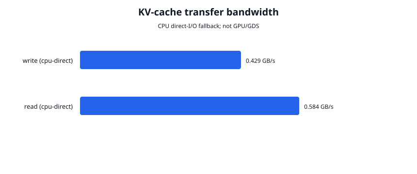
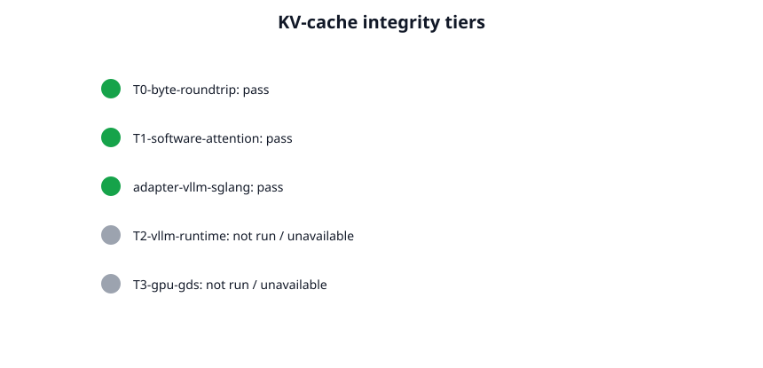
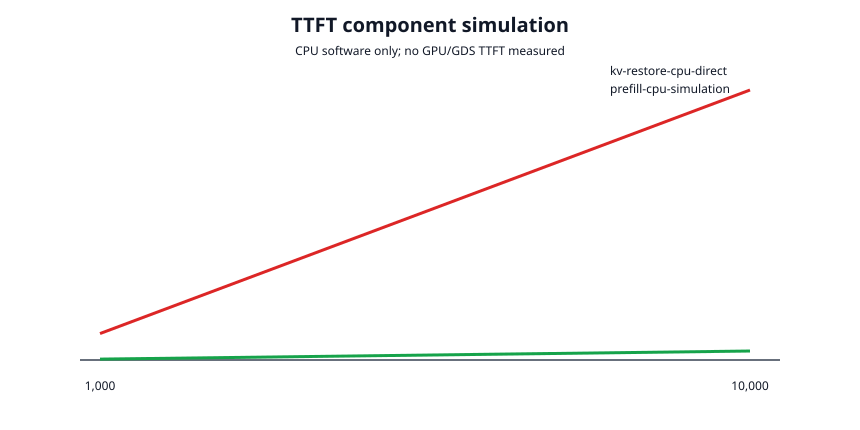

# Phase 4 validation report

## Result

Phase 4's KV-cache format, CPU direct-I/O fallback, branch/session API, Flight
transport, vLLM/SGLang integration surfaces, software attention integrity, and
capability detection pass on commit
`220349c2ce1312b9111c6a3593522b5e0f9769e8`.

GPU/GDS validation is **not available on this machine**. Both the default build
and a build with the optional `gds` feature report:

- no NVIDIA driver
- no `nvidia-fs` device/module
- no CUDA-visible device
- no loadable `libcufile`
- no `gdsio`

All reported bandwidth is CPU `O_DIRECT`; all TTFT values are software
simulations. No NVMe-to-VRAM bandwidth, GPU utilization, vLLM logits, or GDS
speedup is inferred.

Run Phase 4 validation:

```bash
./scripts/validate_phase4.sh
```

Run Phase 4 plus the complete Phase 1–3 plans:

```bash
RUN_FULL_PRIOR_VALIDATION=1 \
SIFT1M_DIR=/path/to/sift1m \
./scripts/validate_phase4.sh
```

Raw metrics, capability reports, manifests, and plots are committed under
[`metrics/phase4/`](../metrics/phase4/).

## Implementation and validation matrix

| Area | Executed validation | Result |
| --- | --- | --- |
| Static gates | Formatting; strict Clippy; default and `gds` feature compilation; Python compilation | Pass |
| Rust tests | 47 normal Phase 1–4 tests | Pass |
| KV format | Versioned tensor spec, 4 MiB blocks, 4 KiB headers/extents, CRC32/BLAKE3 | Pass |
| Tensor layouts | vLLM PagedAttention key/value shape oracles; SGLang layer-major identifier | Pass |
| Durability | Data sync before manifest journal, three fault boundaries, orphan truncation | Pass |
| Branch/session behavior | O(1) manifest inheritance, child replacement isolation, reopen | Pass |
| Corruption | Committed payload mutation rejected | Pass |
| Attention integrity T0 | Flight and direct-store bytes are bit-identical | Pass |
| Attention integrity T1 | Tiny deterministic software attention output is bit-identical after restore | Pass |
| vLLM/SGLang adapters | Store, host restore, destination copy, native transfer ticket | Pass as integration surfaces |
| vLLM runtime T2 | Real model cache restore/logit comparison | Not run; vLLM unavailable |
| GPU/GDS T3 | `gdsio`, cuFile P2P counters, NVMe→VRAM transfer | Not run; hardware unavailable |
| CPU fallback profiling | 128 MiB writes/reads, three iterations, process CPU accounting | Pass |
| Prior regressions | Complete Phase 1–3 plans, SIFT1M, 10M-node materialization | Pass |
| Product comparison | Raw-file baseline plus LMCache/Mooncake command drivers | External products unavailable |

## KV-cache format

`kv-cache.dat` uses 4 MiB direct-I/O blocks. Each block has a 4 KiB header and
a 4 KiB-aligned payload extent suitable for a native GDS reader:

- magic/version, dtype, layout
- chunk index/count and payload length
- tensor-spec fingerprint
- header and payload CRC32
- content-addressed payload and whole-cache BLAKE3 hashes

The manifest records model fingerprint, dtype, layout, tensor geometry,
sequence length, tensor-parallel rank/world, and physical block references.
Supported v1 dtypes are FP16, BF16, FP32, and FP8. Supported layout identifiers
are vLLM PagedAttention v1 and SGLang layer-major v1.

The append-only `kv-cache.log` publishes the data watermark only after
`kv-cache.dat` is synced. Recovery truncates later blocks and incomplete log
records. Forked sessions inherit one immutable manifest; a child replacement
does not alter its parent.

## GPU/GDS capability and bindings

[`capability-gds-build.json`](../metrics/phase4/capability-gds-build.json) was
generated by a release build with `--features gds`. Dynamic loading attempted
the standard CUDA/GDS library locations and sonames; every attempt failed
because `libcufile` is absent. The selected path is therefore `CpuDirect`.

The optional Rust surface dynamically resolves:

- `cuFileDriverOpen` / `cuFileDriverClose`
- `cuFileRead` / `cuFileWrite`
- `cuFileReadAsync` / `cuFileWriteAsync`

It exposes sync/async registered-handle operations and aligned restore tickets.
The implementation deliberately never reports `GdsDirectVerified` merely
because symbols or the driver load. That classification requires a hardware
run with P2P evidence; none occurred here.

## CPU direct-I/O bandwidth

Each operation transferred 128 MiB three times:

| Operation | Backend | Hardware verified | Throughput | CPU time | CPU utilization |
| --- | --- | --- | ---: | ---: | ---: |
| Write | CPU direct | No | 0.429 GB/s | 0.548 s | 58.4% |
| Read | CPU direct | No | 0.584 GB/s | 0.551 s | 79.9% |

The read path validates block headers, payload CRCs, per-block hashes, and the
whole-cache hash. These values are overlay-filesystem VM measurements, not
NVMe or GDS capability numbers.



## Attention integrity tiers

| Tier | Result | What it proves |
| --- | --- | --- |
| T0 byte round-trip | Pass | Flight/direct-store bytes survive persist/restore exactly |
| T1 software attention | Pass | Tiny deterministic f32 attention output is bit-identical |
| vLLM/SGLang adapter surface | Pass | Host restore and aligned native tickets are usable |
| T2 real vLLM runtime | Not run | No vLLM/SGLang model runtime was installed |
| T3 GPU/GDS | Not run | No GPU, CUDA, `libcufile`, or `gdsio` |

T1 is a software integrity oracle, not an LLM compatibility result. It does not
validate model-specific rotary position state, quantization, tensor-parallel
shards, or actual vLLM/SGLang cache ABI versions.



## TTFT simulation

The benchmark intentionally labels both paths `hardware_verified=false`:

| Tokens | Synthetic CPU prefill loop | CPU direct cache restore | Cache bytes |
| ---: | ---: | ---: | ---: |
| 1,000 | 0.216 ms | 6.40 ms | 4.096 MB |
| 10,000 | 2.17 ms | 65.31 ms | 40.96 MB |

The “prefill” loop is not a transformer and these values must not be used to
claim a TTFT speedup or slowdown. The workload only proves that context-size
scaling and cache restore instrumentation are reproducible before a GPU lab
run. The document's 100,000-token, ~60 ms GDS target remains unverified.



## Flight and inference-engine surfaces

Arrow Flight supports:

- `DoPut` descriptor `kv-cache/<session UUID>`
- `DoGet` ticket `KV\n<session UUID>`
- `HardwareCapabilities`
- `GetKVCacheManifest`
- `GetKVCacheTicket`

The Python SDK provides `put_kv_cache`, `get_kv_cache`, manifest/ticket APIs,
`VllmKvCacheAdapter`, and `SglangKvCacheAdapter`. CPU adapters accept bytes,
buffer-protocol objects, NumPy arrays, or detached contiguous Torch-like
tensors without importing either inference runtime. Native tickets provide
4 KiB-aligned file/device extents for an external registered-device plugin.

## Product comparisons

LMCache, Mooncake, vLLM, SGLang, NVIDIA GDS, and a GPU were unavailable, so no
competitor or hardware values are reported. The only measured comparison row is
a 553.6 MB raw-file read baseline (five iterations, 77.45 ms p50); it is not a
KV-offloader product result and may benefit from the Linux page cache.

[`scripts/compare_phase4.py`](../scripts/compare_phase4.py) runs external
LMCache, Mooncake, or vLLM-prefill commands against the same input and records
whether the operator has attested hardware verification. Missing commands
produce no synthetic rows.

## Prior-phase regressions

The complete Phase 1–3 plans were rerun after Phase 4:

- all storage, crash, corruption, Loom, branch, hybrid durability, EnQL, Arrow,
  Flight, and Python validation passed
- release 1,000-operation branch property passed
- SIFT1M mean Recall@10 remained 0.981 over 200 official queries
- the real 10-million-node, 768d, ten-edge materialization completed
- Phase 2 Cachegrind still shows no fused cache benefit
- Phase 3 Flight query validation completed (499 µs p50 on this run)

## Limitations and overall project readiness

- GDS code compiled but no NVIDIA component loaded or executed. Sync/async FFI
  signatures remain hardware-unverified.
- The Rust API expects a handle already registered by a native CUDA plugin;
  cuFile file/buffer registration and CUDA allocation are external integration
  responsibilities.
- KV metadata uses a dedicated transactional journal coordinated by
  `SessionManager`; it is not atomically committed in the same branch-log record
  as B+ tree and HNSW roots.
- v1 writes full cache snapshots. There is no delta cache, reclamation,
  compaction, partial-prefix commit, or divergent KV merge.
- One manifest represents one tensor-parallel rank. Multi-rank atomic publish
  is not implemented.
- Flight `DoPut` buffers the upload before committing and Flight `DoGet` copies
  cache bytes through host memory. It is not a GDS network path.
- Real vLLM/SGLang ABI compatibility, model logits, CUDA context ownership,
  registered-device lifetime, and stream synchronization remain untested.
- The TTFT benchmark is explicitly a CPU software simulation.

Overall readiness:

- **CPU research prototype:** yes. Phases 1–4 provide durable branch storage,
  hybrid indexing, EnQL/Flight sessions, and bit-exact CPU KV-cache persistence.
- **Production database/service:** no. Existing compaction, queueing, merge,
  authentication, distributed serving, and device-fault limitations remain.
- **GPU inference integration:** partial API readiness only.
- **GDS/TTFT performance claims:** no / unverified until a compatible
  NVIDIA+NVMe lab run records P2P counters, `gdsio` bandwidth, host CPU use,
  and bit-identical real-model outputs.
